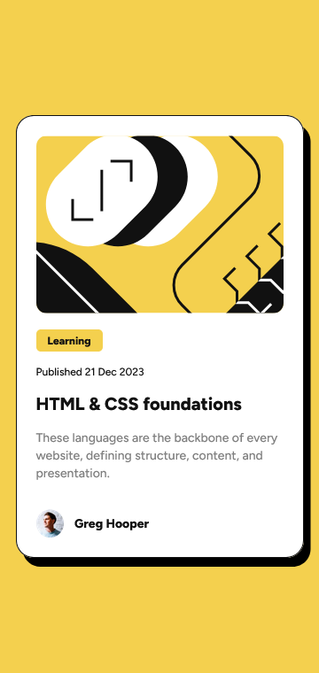

# Frontend Mentor - Blog preview card solution

This is a solution to the [Blog preview card challenge on Frontend Mentor](https://www.frontendmentor.io/challenges/blog-preview-card-ckPaj01IcS). Frontend Mentor challenges help you improve your coding skills by building realistic projects. 

## Table of contents

- [Overview](#overview)
  - [The challenge](#the-challenge)
  - [Screenshot](#screenshot)
  - [Links](#links)
- [My process](#my-process)
  - [What I learned](#what-i-learned)
  - [Continued development](#continued-development)
- [Author](#author)

## Overview

### The challenge

Users should be able to:

- See hover and focus states for all interactive elements on the page

### Screenshot

 

### Links

- Solution URL: [Add solution URL here](https://your-solution-url.com)
- Live Site URL: [Add live site URL here](https://your-live-site-url.com)

## My process

### What I learned

It truns out, in order to crop an image, as seen on the mobile version, you have to nest said image in a dedicated container. That way, it is possible to maintain the border radius.
I decided to keep the attribution section, just putting it in such a way that the user would need to scroll through the page to see it.

### Continued development

I still have to get more acquainted with the intricacies of CSS properties. Certain things don't exactly work the way I would have expected.

## Author

- Frontend Mentor - [@LucasNgTg](https://www.frontendmentor.io/profile/LucasNgTg)
- GitHub - [@LucasNgTg](https://https://github.com/LucasNgTg)
